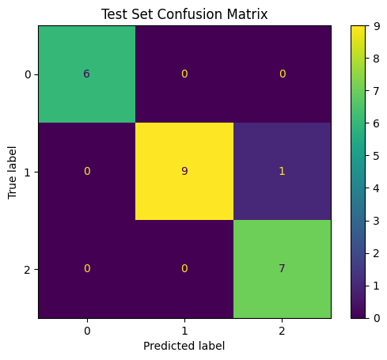
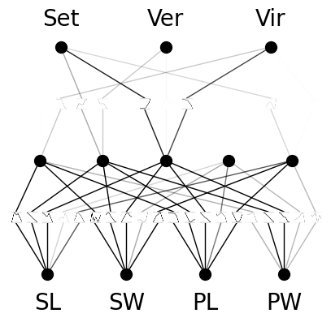

# KAN-Kolomogorov-Arnold-Networks-Multiclass-Classification-on-Tabular-data-
This repository contains the implementation of the Knowledge Augmented Network (KAN) for multi-class classification on tabular datasets (IRIS). KAN leverages domain knowledge and deep learning to enhance predictive performance, particularly in scenarios where data alone might not capture all nuances.

## Visualizations

### Test Confusion Matrix
This confusion matrix visualizes the model's performance on the test set, showing how well the model predicts each class of the IRIS dataset.
  <!-- Ensure the path here matches the location within your repository -->

### KAN Model Plot
This diagram illustrates the architecture of the KAN model, highlighting how domain knowledge is integrated into the network.
  <!-- Ensure the path here matches the location within your repository -->

## Contributing
Contributions are welcome! Please fork this repository, make your changes, and submit a pull request to help improve the model's capabilities.
 
